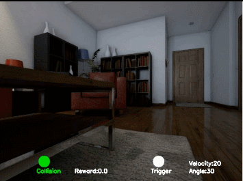

Gym-UnrealCV: Realistic virtual worlds for visual reinforcement learning
===

# Introduction
**This project integrates Unreal Engine with OpenAI Gym for visual reinforcement learning based on [UnrealCV](http://unrealcv.org/).**
In this project, you can run your RL algorithms in various realistic UE4 environments easily without any knowledge of Unreal Engine and UnrealCV.
The framework of this project is shown as below:


- ```UnrealCV``` is the basic bridge between ```Unreal Engine``` and ```OpenAI Gym```.
- ```OpenAI Gym``` is a toolkit for developing RL algorithm, compatible with most of numerical computation library, such as Tensorflow or Theano. 





Snapshots of RL based visual navigation for object searching and obstacle avoidance.

# Installation
## Dependencies
- UnrealCV
- Gym
- CV2
- Matplotlib
- Numpy
- Docker(Optional)
- Nvidia-Docker(Optional)
 
We recommend you to use [anaconda](https://www.continuum.io/downloads) to install and manage your python environment.
```CV2``` is used for images processing, like extracting object mask and bounding box.```Matplotlib``` is used for visualization.
## Install Gym-UnrealCV

It is easy to install gym-unrealcv, just run
```buildoutcfg
git clone https://github.com/zfw1226/gym-unrealcv.git
cd gym-unrealcv
pip install -e . 
```
While installing gym-unrealcv, dependencies including [OpenAI Gym](https://github.com/openai/gym), unrealcv, numpy and matplotlib are installed.
`Opencv` is should be installed additionally. 
If you use ```anaconda```,you can run
```buildoutcfg
conda update conda
conda install --channel menpo opencv
```

## Prepare Unreal Environment
You need prepare an unreal environment to run the demo envirnment. 
You can do it by running the script [RealisticRendering.sh](RealisticRendering.sh)
```buildoutcfg
sh RealisiticRendering.sh
```
or manually download the `RealisticRendering` env from this [link](https://s3-us-west-1.amazonaws.com/unreal-rl/RealisticRendering_RL_3.10.zip), 
then unzip and move it to the [UnrealEnv](gym_unrealcv/envs/UnrealEnv) directory.

**Note that you can download more environments from [UnrealCV Model Zoo](http://docs.unrealcv.org/en/master/reference/model_zoo.html).**

There are two ways to launch the unreal environment in gym-unrealcv, called ```docker-based``` and ```docker-free```.
The ```docker-based``` way depends on [docker](https://docs.docker.com/engine/installation/linux/ubuntu/#install-from-a-package) and [nvidia-docker](https://github.com/NVIDIA/nvidia-docker).
The ```docker-free``` way launches the env binary directly.
The ```docker-based``` way promise more stable unrealcv connection and support to run the env parallelly.
On the contrast, the ```docker-free``` way only support running an unreal environment in the same time.
So the ```docker-based``` way is highly recommended to get better experience.
You can learn to install and use the ```docker-based``` way in this [page](doc/run_docker.md).

**Note that the default config runs in the ``Docker-free`` way.**

# Usage
## Run a random agent

Once ```gym-unrealcv``` is installed successfully, you will see that your agent is walking randomly in first-person view to find a door, after you run:
```
cd example/random
python random_agent.py -e 'Search-RrDoorDiscrete-v0'
```
It will take a few minutes for the image to pull if you runs environment based on docker at the first time. 
After that, if all goes well，a pre-defined gym environment ```Search-RrDoorDiscrete-v0``` will be launched.
And then you will see that your agent is moving around the realistic room randomly.

We list the pre-defined environments in this [page](doc/EnvLists.md), for object searching and active object tracking. 
# Tutorials
We provide a set of tutorials to help you get started with Gym-UnrealCV.
### 1. Modify the pre-defined environment
You can follow the [modify_env_tutorial](doc/config_env.md) to modify the configuration of the pre-defined environment.

### 2. Add a new unreal environment
You can follow the [add_new_env_tutorial](doc/addEnv.md) to add new unreal environment for your RL task.

### 3.   Training a reinforcement learning agent
Besides, we also provide examples, such as [DQN](doc/dqn.md) and [DDPG](doc/ddpg.md), to demonstrate how to train agent in gym-unrealcv.
 
## Cite
If you use Gym-UnrealCV in your academic research, we would be grateful if you could cite it as follow:
```buildoutcfg
@misc{gymunrealcv2017,
    author = {Fangwei Zhong, Weichao Qiu, Tingyun Yan, Alan Yuille, Yizhou Wang},
    title = {Gym-UnrealCV: Realistic virtual worlds for visual reinforcement learning},
    howpublished={Web Page},
    url = {https://github.com/unrealcv/gym-unrealcv},
    year = {2017}
}
```
## Contact
if you have any suggestion or interested in using Gym-UnrealCV, get in touch at [zfw1226@gmail.com](zfw1226@gmail.com).


